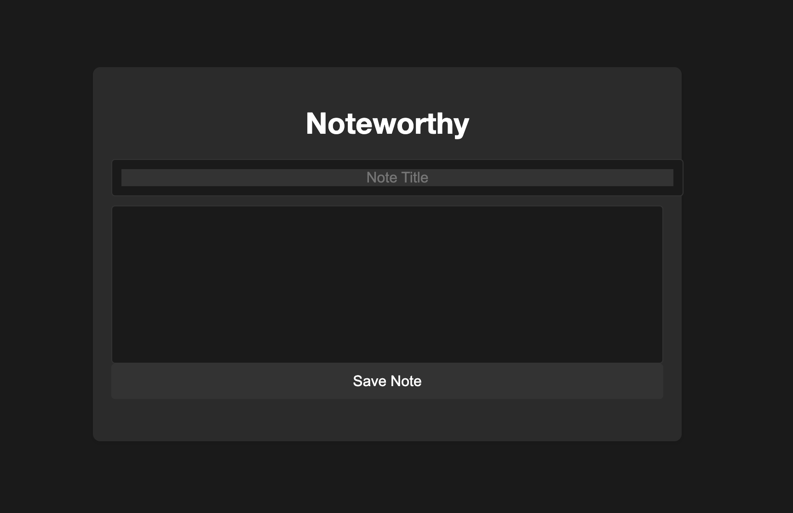

# Noteworthy - Simple Note-Taking App

Noteworthy is a web-based note-taking application that allows users to create, edit, and delete notes. It provides a clean and minimalist interface for organizing your thoughts, ideas, and important information.

## Features

- Create new notes with titles and content.
- Edit existing notes easily.
- Delete notes when they are no longer needed.
- Minimalistic and user-friendly interface.
- Black and white theme for distraction-free note-taking.

## Getting Started

1. Clone the repository:
git clone https://github.com/your-username/note-master.git
cd note-master

2. Open `index.html` in your preferred web browser.

3. Start taking notes!

## Usage

1. Enter a title for your note in the "Note Title" input field.

2. Use the rich text editor to write your note content.

3. Click the "Save Note" button to save your note.

4. Your saved notes will be displayed in the list below the editor.

5. To edit a note, click on the note title and make your changes. Click "Save Note" again to update the note.

6. To delete a note, click the "Delete" button associated with the note.

## Technologies Used

- HTML
- CSS
- JavaScript

## Contributing

Contributions are welcome! If you have any suggestions, improvements, or bug fixes, feel free to open an issue or submit a pull request.

Feel free to customize this README file to match your project's specific details, features, and contributions. Add additional sections if necessary, such as "Roadmap," "Acknowledgments," or "Contact." Make sure to include a screenshot or two showcasing your project's user interface.
